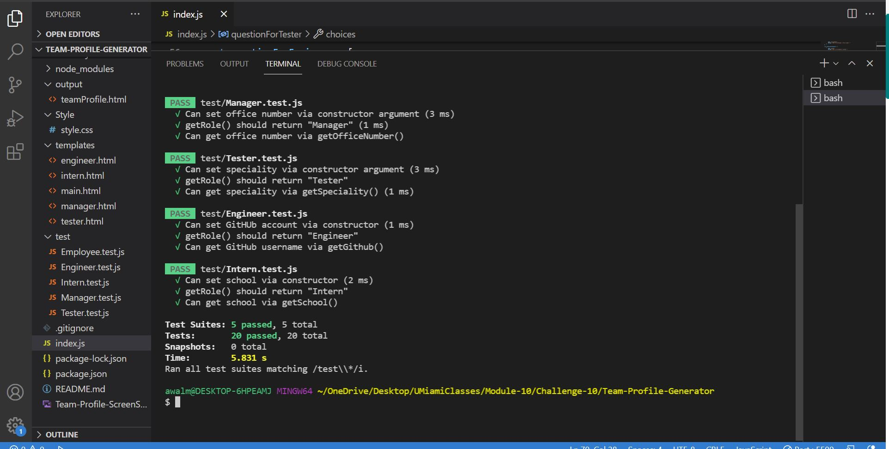

# **TEAM PROFILE GENERATOR**

## Overview

AS A manager, I WANT to generate a webpage that displays my team's basic info SO THAT I have quick access to their emails and GitHub profiles.

## Table of Contents

- [Description](#description)
- [Installation](#installation)
- [Usage](#usage)
- [Test](#test)
- [Deployed](#deployed)
- [Tools](#tools)
- [Research](#research)
- [Questions](#questions)
- [License](#license)

## Description

To dynamically and quickly create a team HTML page, Inquirer NPM was utilized to:

- Generate command-line questions to the user.
- The user input was gathered and added as information to employee templates to create HTML pages.

## Installation

1. Create a .gitignore file and include node_modules? and .DS store. This ensures that the node_modules directory isn't tracked or uploaded to GitHub.
2. Use the command-line, npm install, to install Inquirer NPM.
3. Install jest to test the documents.
4. To start answering questions to create the HTML file, use the command, node index.js.

## Usage

- Inquirer NPM is used to prompt the user to provide information regarding their employee teams to create their HTML
  pages.
- fs.writeFile is used to render the HTML.
- Once the user's information regarding:
  - name, id, email, member's role, then subsequent user role questions are served:
  - Manager - office number, Engineer - Github Username, Tester - speciality and Intern - school name.
- An HTML file with the user's reponses regarding their team is created.

## Test

## Deployed

- \*[Demo Video](https://drive.google.com/file/d/1KFIhgu2eUJxbEVssg5S1yPbxP7SwgJVb/view)
- \*[Deployed website](https://github.com/mirzadev/Team-Profile-Generator/)
- \*[GitHub Repository](https://github.com/mirzadev/Team-Profile-Generator/)

### Screenshot of Inquirer Questions Code

\*[Click the link to view](https://drive.google.com/file/d/1y7uhiUUnXoxOC5O-JVsKbl8qvVVtg4kj/view "Question Inquirer")

## Tools

- JavaScript
- Inquirer NPM
- .gitignore
- Git Bash

## Research

- [Inquirer.js - NPM](https://www.npmjs.com/package/inquirer)

## Questions

- [Email](awal.mirza2016@gmail.com)
- [GitHub Profile](https://github.com/mirzadev)
- [GitHub Repository](https://github.com/Kay0s/https://github.com/mirzadev/Team-Profile-Generator)

## License

© 2021 **Mirza Awal**, a student of UMiami Bootcamp. All Rights Reserved. Permission is hereby granted, free of charge, to any person obtaining a copy of this software and associated documentation files (the "Software"), to deal in the Software without restriction, including without limitation the rights to use, copy, modify, merge, publish, distribute, sublicense, and/or sell copies of the Software, and to permit persons to whom the Software is furnished to do so, subject to the following conditions:

The above copyright notice and this permission notice shall be included in all copies or substantial portions of the
Software.

_THE SOFTWARE IS PROVIDED "AS IS", WITHOUT WARRANTY OF ANY KIND, EXPRESS OR IMPLIED, INCLUDING BUT NOT LIMITED TO THE WARRANTIES OF MERCHANTABILITY, FITNESS FOR A PARTICULAR PURPOSE AND NONINFRINGEMENT. IN NO EVENT SHALL THE AUTHORS_
**OR**
_COPYRIGHT HOLDERS BE LIABLE FOR ANY CLAIM, DAMAGES OR OTHER LIABILITY, WHETHER IN AN ACTION OF CONTRACT, TORT OR OTHERWISE, ARISING FROM, OUT OF OR IN CONNECTION WITH THE SOFTWARE OR THE USE OR OTHER DEALINGS IN THE SOFTWARE._
# Team_Profile_Repository
